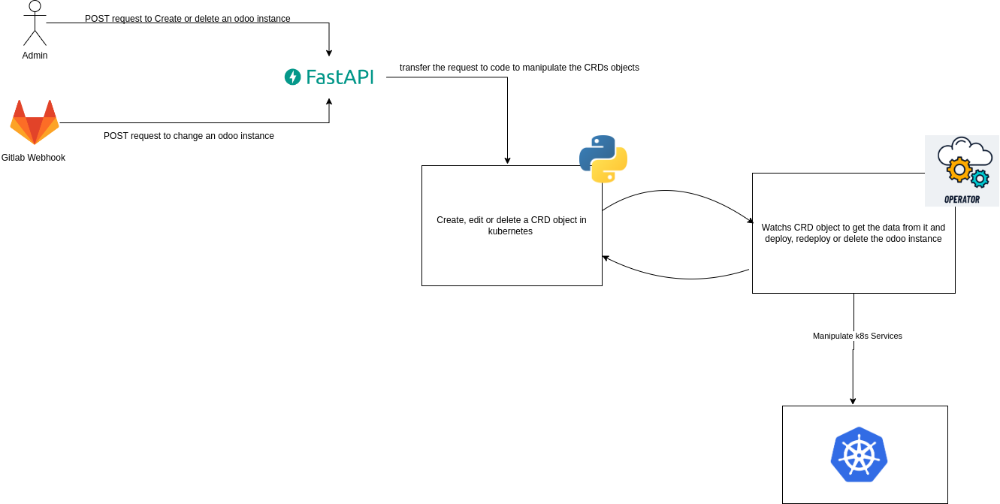
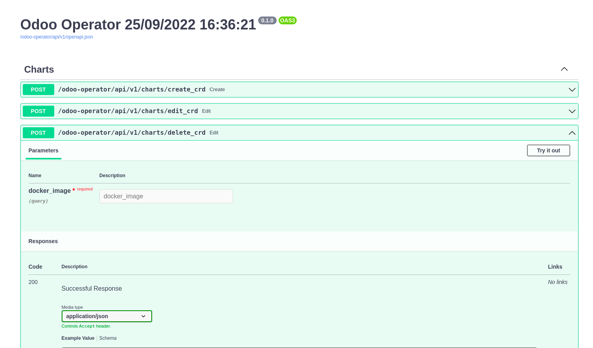
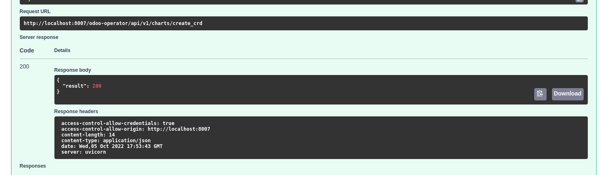
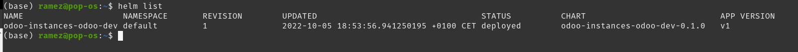
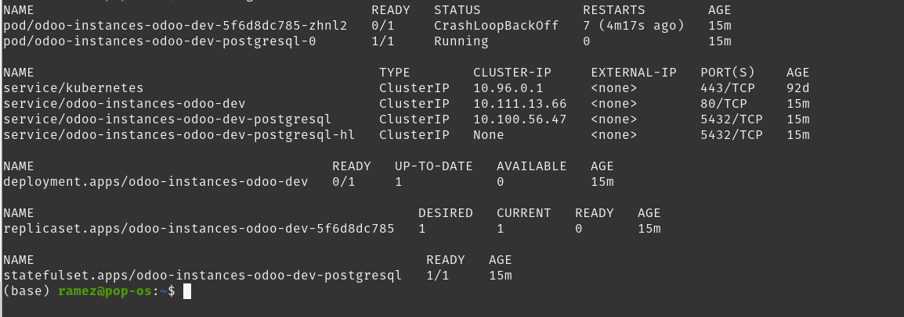
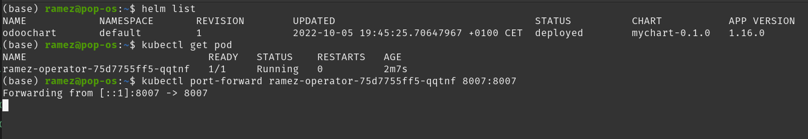

# Kubernetes Operator

## Introduction

In this project I will explain how to build an operator that manages a specific CRD objects.

As we know kubernets is written with GO language so it would be more easier to comminucate with kubernetes and HELM APIs with GO but in this project we will be using python so it will be a great challenge to try something new.

Before we start coding and gets hands on let us first know what is an operator and what's its relation with CRDs.

---

## Description

- CRD: A custom resource definition (CRD) is a powerful feature introduced in Kubernetes 1.7. The standard Kubernetes distribution ships with many built-in API objects and resources. CRDs enable IT admins to introduce unique objects or types into the Kubernetes cluster to meet their custom requirements.\
  So let's think of it as a class that contains many attributes so we can use later to create an object and read the data from it

- Why do we need an operator: Well an operator is like a controller that make use of CRDs to manage applications and their components.\
  So basically the operator will be responsable for watching the CRDs (any change in the CRD objects will be detected such us creation, update or deletion) and after detecting each event, the operator will automatically deploy, redeploy or uninstall a helm chart based on the type of CRD change in our case.

let's undersatnd the architecture first and move to coding after.

---

## Architecture

As we can see in the figure below we will create an operator that will watch for us the CRD and manage the deployments and we will create a server with the help of FastAPI that will manages the requests for us.\
So in the final product we will be able to send a json file throw FastAPI that will be converted to CRD and then the operator will be able to manage the kubernetes services based on the changes made on the CRD objects.\
In this project, I chose to work with odoo images but of course we can choose any other image or technology

<h1 align="center" style="display: block; font-size: 2.5em; font-weight: bold; margin-block-start: 1em; margin-block-end: 1em;">

  <br><br><strong>Overall Architecture</strong>
</h1>

## Backend Requirements

- [Kubernetes](https://kubernetes.io/).
- [HELM](https://helm.sh/).
- [Docker](https://www.docker.com/).
- [Docker Compose](https://docs.docker.com/compose/install/).
- [Poetry](https://python-poetry.org/) for Python package and environment management.

## Frontend Requirements

- [Node.js](https://nodejs.org/en/) (with `npm`).

---

## Hands On

To begin with, let's start with the server where we will interact with the Swagger UI to send our requests

## Backend local development, additional details

### General workflow

By default, the dependencies are managed with [Poetry](https://python-poetry.org/),we can go there and install it.

From `./Operator/app/` we can install all the dependencies with:

```console
$ poetry install
```

Then we can start a shell session with the new environment with:

```console
$ poetry shell
```

Next, we have to open our editor at `./Operator/app/` (instead of the project root: `./`), so that we see an `./app/` directory with our code inside. That way, our editor will be able to find all the imports, etc. We have to make sure our editor uses the environment we just created with Poetry.

We can modify or add SQLAlchemy models in `./Operator/app/app/models/`, Pydantic schemas in `./Operator/app/app/schemas/`, API endpoints in `./Operator/app/app/api/`, CRUD (Create, Read, Update, Delete) utils in `./Operator/app/app/crud/`. The easiest might be to copy the ones for Items (models, endpoints, and CRUD utils) and update them to our needs.

After installing the required packages and runing the `run_server.py` file we can
open open this URL: http://localhost:8007/odoo-operator/api/v1/docs#/ to interact with the swagger UI.
As we can see we will notice three endpoints {`create_crd`, `edit_crd`, `delete_crd`} which are responsable for the CRUD (create, read, update and delete) of our CRD objects

<h1 align="center" style="display: block; font-size: 2.5em; font-weight: bold; margin-block-start: 1em; margin-block-end: 1em;">

  <br><br><strong>Swagger UI</strong>
</h1>

## Operator Logic

Now if we move on to the dicrectory `./Operator/odoo_operator/` we will the existence of those files :

- `cli.py`: the main file to launch the operator and choose the duration time for runnig it.

- `const.py`: this file is responsable for saving the constants that we will use in our project.

- `create_crd.py`: this file is responsable for creating a CRD object

- `delete_crd.py`: this file is responsable for deleting a CRD object

- `edit_crd.py`: this file is responsable for updating a CRD object

- `load_crd.py`: this file is responsable for showing all CRD objects

- `operators.py`: this file is responsable for the logic of the operator where it will watch all resources or objects related to our specific CRD and based on each event it will call the function responsable for it.

## Run the project locally

Now let's run the project together.
First, let's crate a cluster in kubernetes to comunicate with. You can use minikube for that.

```console
$ minikube start
```

Then, let's create the crd by typing this command:

```console
$ kubectl apply -f ./HELM/templates/crd.yaml
```

Great, now let's run the server and the operator at the same time.
For that we can just run the script `start_script.sh` or run the files `./run_server.py` and `./odoo_operator/cli.py`.

After that we can copy the content of `request.json` and paste in the Swagger UI and send the request

we should get a result like this on Swagger UI:



And we can see the results also by seeing the helm chart list:

```console
$ helm list
```



As we can see a helm has been installed in our cluster ( by that we mean that the helm has installed all the services in kubernetes )
we can type this command to see all the services installed:

```console
$ helm list
```



---

Awesome, now let's dig in and see what happend exactly.
After sending the request to FastAPI throw the Swagger UI, our server will get the json request and translate it into CRD object that will be deployed in our cluster.
After that the operator will notice the creation of the new CRD object so it will get all the data from it and pass it to the `call_operator` function that will use it as values for our helm. Now for the Helm part we've already crated helm chart with all the templates for our services that we will use for our odoo instance. for that we used the `avionix` package that will communicate with HELM APIs so we can install, update or uninstall a helm chart.
We can find the helm chart in `Operator/odoo_operator/mychart` directory

For `edit_crd` and `delete_crd` the same process
will be repeated again so we can test it later.

## Deploying our project in Kuberentes

Finally, we came to the last part of the project where we will deploy this project in kubernetes cluster.

To do that, whe have to dockerize first our project by typing this command:

```console
$ docker build -t ramezbenaribia/odoo-operator:20.0 .
```

Then we can push our docker image into Docker Hub so that we use it later in our helm chart:

```console
$ docker push  ramezbenaribia/odoo-operator:20.0
```

Finally we can deploy the project with helm where we used RBAC so we can assign priveleges to our users so that they can interacte with the services and of course the helm will create for us the CRD that we will use later.
To do that we can update the values.yaml of the helm chart first and add to it the desired image that we want to deploy.
And then we can deploy our services by runing this command inside of the `HELM` directory:

```console
$  helm install odoochart .
```

And of Course we have to delete the CRD of our cluster if it's already installed in our cluster so that it can be managed easilly by Helm.

```console
$  kubectl delete crd odoos.operators.com
```



Finally, as we can see in the results, we will notice the creation of a new pod that contain our project so we can easilly now forword the port of that pod to our localhost so we can interact with it by runing this command:

```console
$  kubectl port-forward ramez-operator-75d7755ff5-qqtnf 8007:8007
```

---

# Conclusion

The idea of this project was to automate deployments and reducing time. So let's say that the fastest way to deploy an instance will take us up to `10 minutes` even more, now it will only take `1 minute` to write the JSON object and deploy the instance.As results we will find ourselves reducing `90%` of the time that we will need to deploy a new instance and of course reducing the human errors by implementing the crd logic in the middle of the process.
